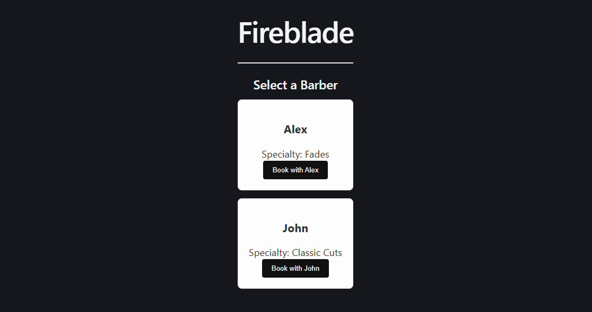
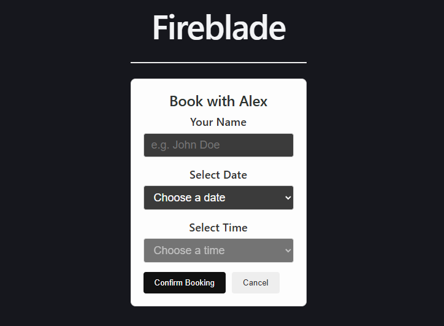
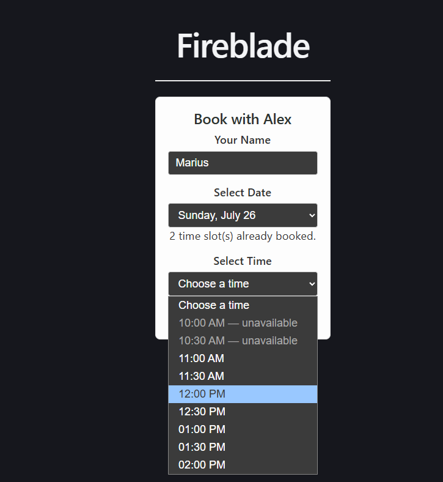
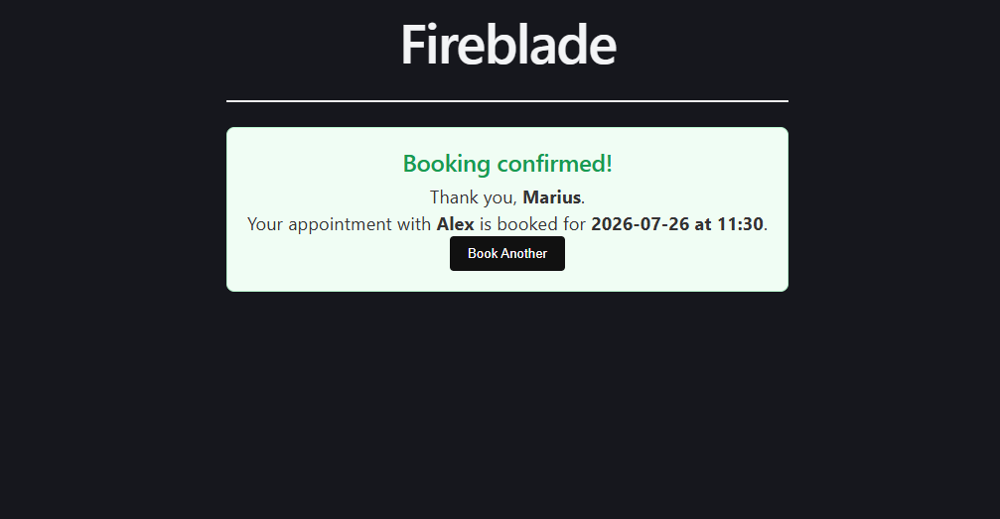
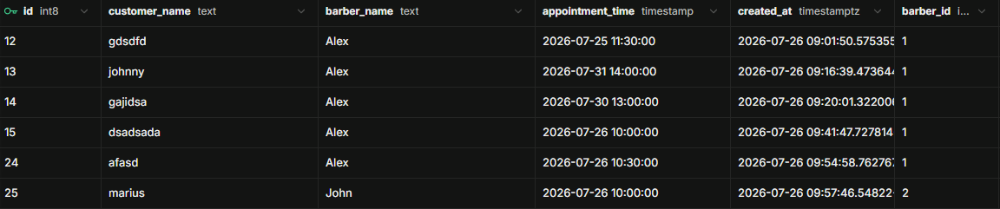
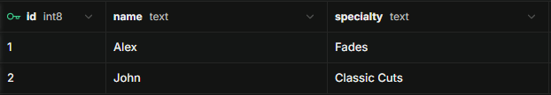

# Fireblade Barber Booking System

A full-stack booking prototype built to learn how a React interface, an external API, and a relational database work together. Customers can select a barber, choose a date and available time, and save the appointment to Supabase.

## What this project demonstrates

- React component design, state management, and effects
- Asynchronous loading, error, empty, and success states
- Supabase/PostgreSQL reads and writes
- Row-Level Security and restricted public data access
- Dynamic generation of upcoming booking dates
- Availability queries by barber and date
- Double-booking protection at both the UI and database layers
- Separation between components, services, and utility functions

## Screenshots

Front page



Booking form



Dynamiclly generated dates and retriving booked times for the barber from the Database



Booking confirmation



Bookings table



Barber table



## How it works

Barbers are loaded from Supabase when the application starts. After a customer selects a barber and date, the application fetches that barber's booked times and disables unavailable options. A confirmed appointment is then inserted into the database.

## Technology

- React 19
- JavaScript
- Vite
- Supabase
- PostgreSQL
- CSS

## Project structure

```text
src/
├── components/   User-interface components
├── services/     Supabase queries and mutations
├── utils/        Date and time transformations
├── App.jsx       Application state and screen coordination
└── supabaseClient.js
```

## Challenges and lessons

### Time representation

JavaScript `Date` objects serialize as UTC. Because this prototype models the wall-clock time of one local barber shop, appointments are stored as timezone-free local date-times. A multi-location version should instead store UTC together with each shop's timezone.

### Race conditions

Checking availability before inserting is not enough: two customers could see the same slot as available and submit at nearly the same time. The database uniqueness constraint resolves this race safely, while React translates the PostgreSQL conflict into a useful customer message.

### Remote data is more than an array

Database-backed UI needs explicit loading, error, empty, and success states. Modeling those states separately prevents indefinite loading screens and misleading empty interfaces.

## Current limitations

- Appointment times are currently predefined.
- All appointments implicitly use the same duration.
- There is no cancellation workflow or barber dashboard.
- Anonymous booking creation needs additional anti-spam protection for production.
- The database prevents identical start times, but does not yet model overlaps between services of different durations.

## Next steps

- Generate time slots from opening hours and appointment duration
- Add services, prices, and duration-based availability
- Add authenticated barber/admin tools
- Add automated tests for date generation, availability, and booking conflicts
