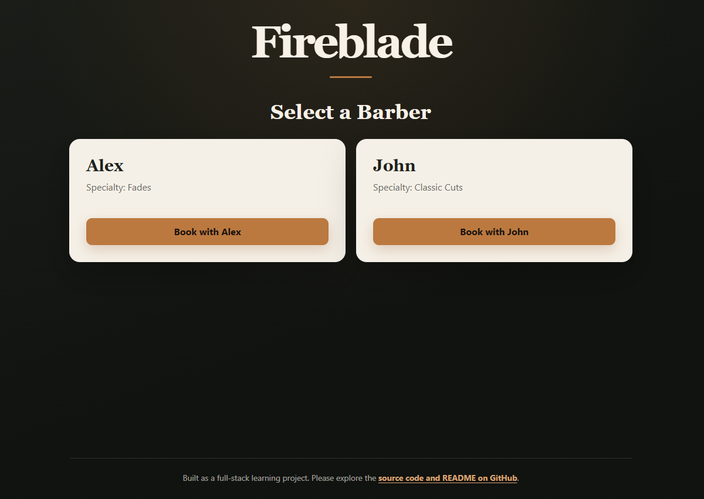
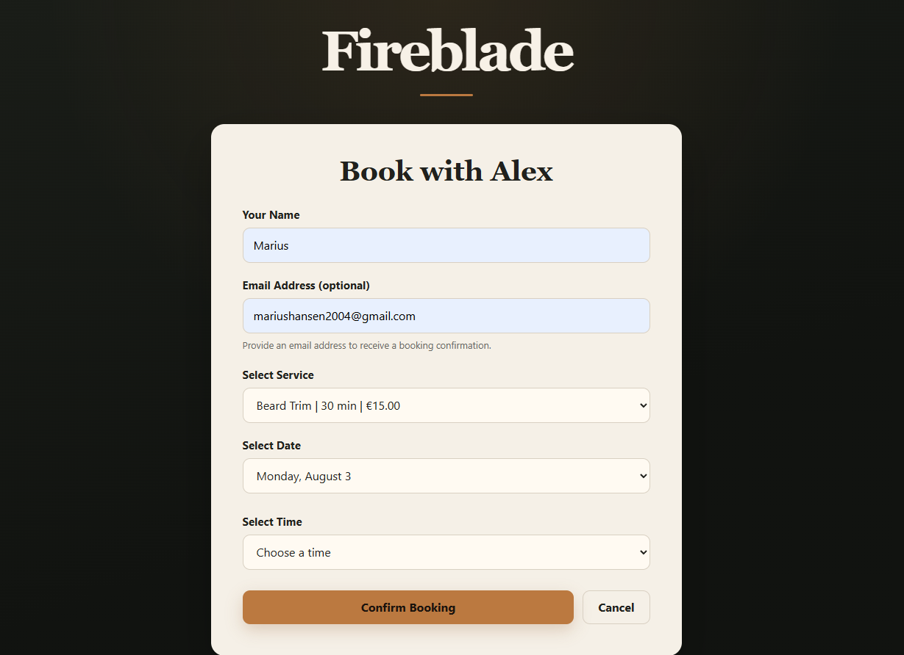
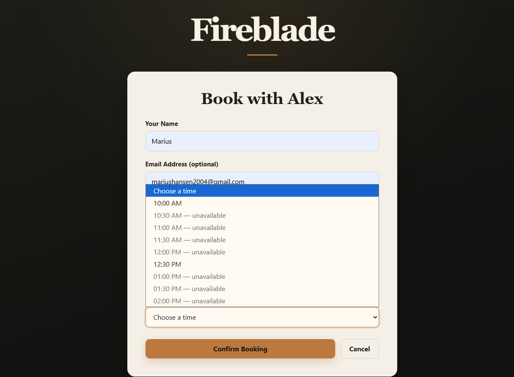
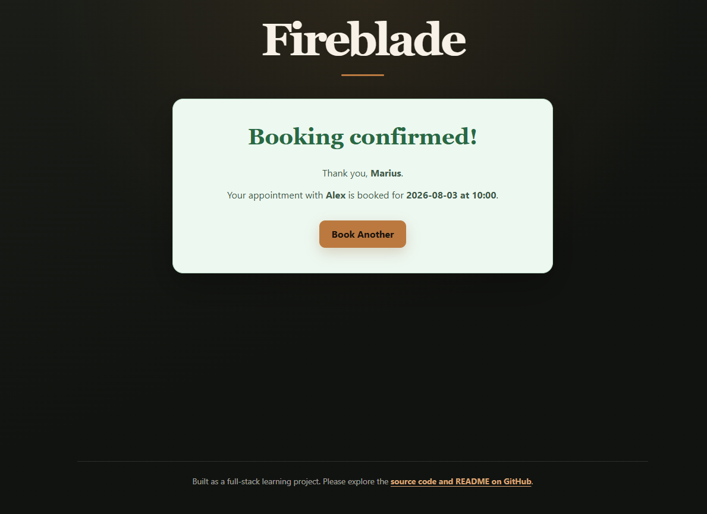
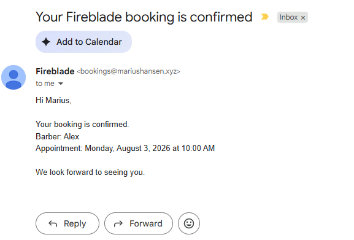
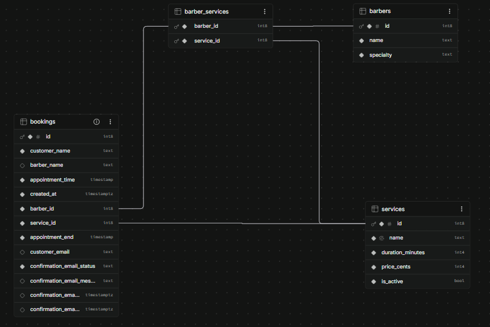

# Fireblade Barber Booking System

A full-stack appointment booking system built with React, Supabase, PostgreSQL, and Resend. Customers can choose a barber and service, view availability, reserve an appointment, and optionally receive an email confirmation.

## Project at a glance

- **Frontend:** A React interface guides customers through barber selection, booking, and confirmation, with clear loading and error feedback.
- **Services and availability:** Each barber offers specific services with different prices and durations. Existing appointments are used to disable overlapping times.
- **Database:** PostgreSQL stores barbers, services, their relationships, and bookings.
- **Booking safety:** The database prevents overlapping appointments, including when two customers submit at nearly the same time.
- **Backend:** A Supabase Edge Function validates booking requests and keeps privileged operations outside the browser.
- **Security:** Customers can view availability without accessing private booking details.
- **Email:** Customers can optionally receive a confirmation through Resend after their booking is saved.

## Architecture

```text
React booking interface
        |
        v
Frontend service adapters
        |
        +--> Supabase database API --> PostgreSQL reads protected by RLS
        |
        +--> Supabase Edge Function --> PostgreSQL insert, trigger, and constraints
                                  |
                                  +--> Resend email API
```

The React frontend reads public barber and service information from RLS-protected tables. Availability comes from the restricted `booked_slots` view, which does not expose customer details. New bookings are sent to an Edge Function, where the request is validated before it reaches PostgreSQL. The database calculates the appointment end time and rejects overlapping bookings. A confirmation email is attempted only after the booking is saved, so an email failure does not cancel the appointment.

## Use of AI

I used AI as a learning and development assistant to explore unfamiliar concepts, draft parts of the React, SQL, and Edge Function code, and investigate errors. I reviewed and adapted the output rather than using it unchanged.

For example, manual testing exposed a timezone conversion that stored a 10:00 appointment as 08:00. I investigated the cause and changed the time representation. I also replaced direct frontend booking inserts with an Edge Function when the workflow began to require trusted validation and a secret email-provider key.

## Screenshots

### Front page / barber selection



### Booking form



### Availability checks



### Booking confirmation



### Email confirmation



### Database relations



## How it works

Barbers are loaded from Supabase when the application starts. Selecting a barber loads the services that barber provides, including each service's price and duration. The frontend generates the next seven booking dates and fetches the selected barber's booked intervals through a restricted database view.

The chosen service duration is used to disable start times that would overlap an existing appointment. When the customer submits the form, the Edge Function validates the request, loads trusted barber and service data, and inserts the booking. A database trigger calculates the appointment end time, and a PostgreSQL exclusion constraint prevents overlapping bookings even if two customers submit simultaneously. If the customer provided an email address, the function then asks Resend to send a confirmation and records the result without making the booking depend on the email succeeding.

## Technology

- React 19
- JavaScript
- Vite
- Supabase JavaScript client
- Supabase Edge Functions
- PostgreSQL, including RLS, triggers, foreign keys, and an exclusion constraint
- Resend email API
- CSS

## Project structure

```text
src/
├── components/         User-interface components
├── services/           Frontend adapters for database and Edge Function calls
├── utils/              Date, time, and availability calculations
├── App.jsx             Application state and screen coordination
└── supabaseClient.js   Supabase browser-client configuration
```

## Challenges and lessons

### Time representation

JavaScript `Date` objects serialize as UTC. Because this prototype models the wall-clock time of one local barber shop, appointments are stored as timezone-free local date-times. A multi-location version should instead store UTC together with each shop's timezone.

### Race conditions

Checking availability before inserting is not enough: two customers could see the same slot as available and submit at nearly the same time. The database exclusion constraint resolves this race safely, while React translates the API conflict into a useful customer message.

### Moving trusted operations to the backend

The first version created bookings directly from the React client. That approach was useful while learning Supabase, but it became the wrong boundary once booking creation required trusted validation and an external email provider.

I moved the booking workflow into a Supabase Edge Function. The browser now sends only the customer's choices, while the backend validates the request, loads trusted barber and service data, performs the database insert, and calls Resend. This keeps business rules and privileged operations in an environment the user cannot modify. The Resend API key is stored as an Edge Function secret and is never included in the browser bundle.

### RLS and limiting frontend exposure

I learned that connecting a frontend directly to Supabase does not mean every database row should be public. Row-Level Security (RLS) policies define which database operations each client is allowed to perform, even when a request is made using the public Supabase key.

The frontend can read public information such as barbers, services, and the minimum booking data needed to calculate availability. Private customer details are not exposed. A restricted database view provides only the appointment fields required by the booking interface instead of returning complete booking rows.

This taught me to treat the frontend as an untrusted environment: users can inspect its code and change its requests. The Supabase publishable key can safely identify the project when RLS is configured correctly, but provider credentials and Supabase secret keys can authorize privileged or billable actions and must remain on the backend.

### Remote data is more than an array

Database-backed UI needs explicit loading, error, empty, and success states. Modeling those states separately prevents indefinite loading screens and misleading empty interfaces.

## Current limitations

- Available start times are predefined in the frontend rather than generated from database-managed opening hours.
- The booking window is fixed to the next seven calendar days and does not yet model closed days, breaks, or barber-specific schedules.
- There is no cancellation workflow or barber dashboard.
- Anonymous booking creation needs additional anti-spam protection for production.
- Email status currently records whether Resend accepted the send request; delivery and bounce events are not yet synchronized through webhooks.

## Next steps

- Model opening hours and barber schedules, then generate valid start times from that data
- Add authenticated barber/admin tools and a cancellation workflow
- Process Resend webhooks to track delivered and bounced messages
- Add automated tests for date generation, availability, and booking conflicts
- Store the database schema and Edge Function source in the repository for reproducible deployments
